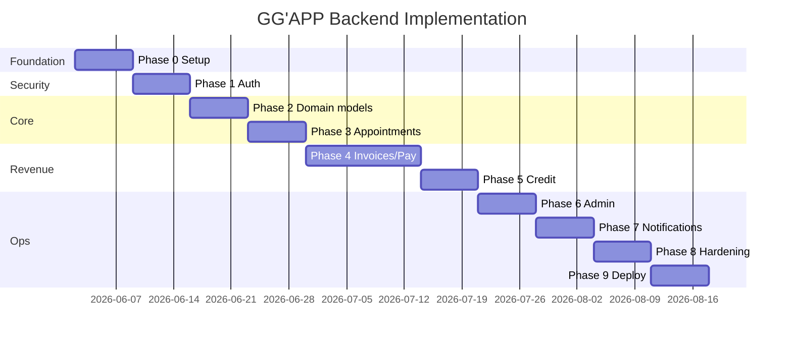

# GG'APP Backend — Implementation Plan

This document defines the backend architecture, phased delivery plan, Prisma schema draft, and NestJS module scaffold for GG'APP. It is aligned with:

- `Tech_stack_to_use.md` (§7.4 Backend Technologies, §7.5 Database Architecture)
- The frontend API contract in `src/api/` (base URL: `http://localhost:3000/api/v1`)

---

## Table of contents

1. [Goals & scope](#1-goals--scope)
2. [Tech stack mapping](#2-tech-stack-mapping)
3. [Project layout](#3-project-layout)
4. [Phased implementation plan](#4-phased-implementation-plan)
5. [API contract (frontend-aligned)](#5-api-contract-frontend-aligned)
6. [Redis usage](#6-redis-usage)
7. [Prisma schema draft](#7-prisma-schema-draft)
8. [NestJS module scaffold](#8-nestjs-module-scaffold)
9. [Background jobs & integrations](#9-background-jobs--integrations)
10. [Security & audit](#10-security--audit)
11. [Deployment & CI/CD](#11-deployment--cicd)
12. [Risks & early decisions](#12-risks--early-decisions)
13. [Immediate next steps](#13-immediate-next-steps)

---

## 1. Goals & scope

### Goal

Build a **versioned REST API** at `/api/v1` that replaces frontend mock mode when `VITE_USE_MOCK_API=false`, covering all business domains in PostgreSQL and using Redis for ephemeral state, queues, and caching.

### In scope

- NestJS REST API for Patient, Service Provider, and Admin portals
- Auth (JWT + refresh tokens, Google OAuth, payment PIN)
- Appointments, invoices, payments, credit, notifications
- Background jobs (email, push, payment retries, webhooks)
- Audit logging for security-sensitive events

### Out of scope (separate tracks)

- React Native Android app (§7.3) — consumes same API + FCM
- Frontend UI changes — backend conforms to existing frontend types

### MVP cutoff

Fastest path to flip `VITE_USE_MOCK_API=false`:

**Phases 0 → 4** + minimal admin SP approval + email verification.

---

## 2. Tech stack mapping

| Doc requirement | Implementation |
|-----------------|----------------|
| Node.js LTS v20+ | Runtime in Docker + CI |
| NestJS v10 + TypeScript | `@nestjs/*` monolith (modular) |
| Prisma ORM | `@prisma/client`, migrations |
| class-validator + class-transformer | DTOs + global `ValidationPipe` |
| Passport.js + JWT | `@nestjs/passport`, `passport-jwt`, `passport-local`, `passport-google-oauth20` |
| bcrypt | Password + payment PIN hashing |
| Helmet.js | Security headers |
| @nestjs/throttler | Rate limiting (Redis store in prod) |
| cors | Whitelist frontend origin |
| BullMQ + @nestjs/bullmq | Async jobs |
| Nodemailer + Brevo | Transactional email |
| web-push | PWA push notifications |
| Firebase Admin SDK | Android FCM |
| Winston | Structured logging |
| Multer | License docs, invoice PDF uploads |
| PostgreSQL 15 | Primary database |
| Redis 7 | Refresh tokens, rate limits, queues, caches |

---

## 3. Project layout

Recommended as a **sibling repo** or monorepo package:

```
gg-api/
├── .env.example
├── docker-compose.yml          # postgres:15, redis:7
├── Dockerfile
├── package.json
├── nest-cli.json
├── tsconfig.json
├── prisma/
│   ├── schema.prisma           # See §7
│   ├── migrations/
│   └── seed.ts                 # Mirrors src/mock/ in frontend
├── src/
│   ├── main.ts
│   ├── app.module.ts
│   ├── common/
│   │   ├── decorators/         # @Roles(), @CurrentUser()
│   │   ├── filters/            # HttpExceptionFilter
│   │   ├── guards/             # JwtAuthGuard, RolesGuard
│   │   ├── interceptors/       # LoggingInterceptor
│   │   └── pipes/              # ValidationPipe config
│   ├── config/
│   │   ├── configuration.ts
│   │   └── env.validation.ts
│   ├── prisma/
│   │   ├── prisma.module.ts
│   │   └── prisma.service.ts
│   ├── redis/
│   │   ├── redis.module.ts
│   │   └── redis.service.ts
│   └── modules/                # See §8
│       ├── auth/
│       ├── users/
│       ├── providers/
│       ├── appointments/
│       ├── invoices/
│       ├── payments/
│       ├── credit/
│       ├── notifications/
│       ├── admin/
│       ├── audit/
│       └── files/
└── test/
    ├── auth.e2e-spec.ts
    └── invoices.e2e-spec.ts
```

### Environment variables

```env
# App
NODE_ENV=development
PORT=3000
API_PREFIX=api/v1
CORS_ORIGIN=http://localhost:5173

# Database
DATABASE_URL=postgresql://gg:gg@localhost:5432/gg_app?schema=public

# Redis
REDIS_URL=redis://localhost:6379

# JWT
JWT_ACCESS_SECRET=change-me-access
JWT_REFRESH_SECRET=change-me-refresh
JWT_ACCESS_TTL=15m
JWT_REFRESH_TTL=30d

# Encryption (National ID at rest)
FIELD_ENCRYPTION_KEY=32-byte-hex-key

# OAuth
GOOGLE_CLIENT_ID=
GOOGLE_CLIENT_SECRET=
GOOGLE_CALLBACK_URL=http://localhost:3000/api/v1/auth/google/callback

# Web Push (VAPID)
VAPID_PUBLIC_KEY=
VAPID_PRIVATE_KEY=
VAPID_SUBJECT=mailto:support@ggapp.example

# Email (Brevo)
BREVO_API_KEY=
EMAIL_FROM=noreply@ggapp.example

# Firebase (FCM)
FIREBASE_PROJECT_ID=
FIREBASE_CLIENT_EMAIL=
FIREBASE_PRIVATE_KEY=

# File storage
UPLOAD_DIR=./uploads
# Or S3_BUCKET, S3_REGION, S3_ACCESS_KEY, S3_SECRET_KEY

# Finance partners (adapters)
MONEYMART_API_URL=
MONEYMART_API_KEY=
EQUITY_API_URL=
EQUITY_API_KEY=
```

---

## 4. Phased implementation plan

### Phase 0 — Foundation (Week 1)

| Task | Details |
|------|---------|
| Bootstrap NestJS | `@nestjs/core`, `@nestjs/platform-express`, `@nestjs/config` |
| Docker Compose | PostgreSQL 15 + Redis 7 |
| Prisma setup | Initial schema, migration pipeline |
| Global middleware | Helmet, CORS, compression, request ID |
| Logging | Winston JSON in production |
| Health checks | `GET /api/v1/health`, `GET /api/v1/health/ready` |
| Swagger | `/api/docs` (dev only) |

**Exit criteria:** `docker compose up` → API responds; Prisma migrates; Redis connects.

---

### Phase 1 — Auth & security (Week 2)

| Method | Route | Purpose |
|--------|-------|---------|
| POST | `/auth/login` | Email/password → session |
| POST | `/auth/refresh` | Rotate tokens |
| POST | `/auth/logout` | Revoke refresh token |
| POST | `/auth/google` | OAuth code → patient session |
| POST | `/auth/register/patient` | Create patient + verification email |
| POST | `/auth/register/sp` | Create SP application (pending) |

**Implementation:**

- `User.role`: `PATIENT | SP | ADMIN`
- Patient profile table with encrypted `nationalId`
- Payment PIN: separate `pinHash`, lockout in Redis (3 attempts → 30 min)
- Access JWT ~15 min; refresh JWT ~30 days in Redis
- Passport: `local`, `jwt`, `google-oauth20`
- Guards: `JwtAuthGuard`, `RolesGuard`
- Throttling on auth/PIN/register routes

**Exit criteria:** Frontend login/register/logout works with real tokens.

---

### Phase 2 — Core domain models (Week 3)

PostgreSQL domains from §7.5.1:

- Users, Patient profiles, Beneficiaries
- Service Providers, service types, hours, documents
- Provider public listing for patient portal

| Method | Route |
|--------|-------|
| GET | `/patient/profile` |
| GET | `/patient/dashboard` |
| GET | `/patient/appointments` |
| GET | `/patient/transactions` |
| GET | `/patient/notifications` |
| GET | `/patient/news` |
| GET | `/providers` |
| GET | `/providers/category/:category` |
| GET | `/providers/:id` |

**Exit criteria:** Patient dashboard/profile match frontend types in `src/types/user.types.ts`.

---

### Phase 3 — Appointments (Week 4)

Status flow: `REQUESTED → CONFIRMED → COMPLETED | CANCELLED`

| Method | Route |
|--------|-------|
| POST | `/patient/appointments` |
| PATCH | `/sp/appointments/:id` |
| GET | `/sp/dashboard` |
| GET | `/sp/appointments/:id` |
| POST | `/sp/visits/record` |
| GET | `/sp/patients/:id` |

Side effects: notifications + audit log on status changes.

---

### Phase 4 — Invoices & payments (Week 5–6)

Invoice lifecycle:

```
PENDING_AUTH → AUTHORIZED → PAID
     ↓              ↓
  DISPUTED       REJECTED (admin)
     ↓
  RESOLVED
```

| Method | Route |
|--------|-------|
| GET | `/patient/invoices` |
| GET | `/patient/invoices/:id` |
| POST | `/patient/invoices/:id/authorize` |
| POST | `/sp/invoices/upload` |
| GET | `/sp/invoices/:id` |
| GET | `/admin/invoices` |
| PATCH | `/admin/invoices/:id` |

**Payment authorization (critical path):**

1. Validate PIN per step (1–3); track attempts in Redis
2. On step 3: store idempotency key (5-min TTL)
3. Enqueue `payment.disburse` job → finance partner API
4. Create `Transaction`, set invoice `PAID`, notify parties
5. Append audit events for every PIN attempt and authorization

**Exit criteria:** Frontend triple-PIN flow works; no duplicate disbursements on retry.

---

### Phase 5 — Credit & finance partners (Week 7)

| Method | Route |
|--------|-------|
| GET | `/patient/credit/wallet` |
| POST | `/patient/credit/apply` |
| POST | `/patient/credit/increase` |
| GET | `/patient/credit/status` |

- Adapter pattern: `MoneyMartAdapter`, `EquityAdapter`
- Wallet balance cached in Redis (60s TTL)
- Mock adapter for dev/staging

---

### Phase 6 — Admin portal (Week 8)

| Method | Route |
|--------|-------|
| GET | `/admin/dashboard` |
| GET | `/admin/applications` |
| PATCH | `/admin/applications/:id` |
| GET | `/admin/disputes` |
| PATCH | `/admin/disputes/:id` |

Admin users seeded via migration or CLI (`ADMIN` role).

---

### Phase 7 — Notifications & background jobs (Week 9)

| Queue | Jobs |
|-------|------|
| `email` | Verification, invoice alerts, password reset |
| `push` | Web Push + FCM |
| `payments` | Disbursement retries, webhooks |
| `webhooks` | Finance partner callbacks |

| Method | Route |
|--------|-------|
| POST | `/notifications/push/subscribe` |
| POST | `/notifications/push/unsubscribe` |

Log all dispatches in `NotificationLog`.

---

### Phase 8 — Audit, observability & hardening (Week 10)

- Append-only `AuditEvent` table
- Winston + request correlation ID
- DTO validation on all inputs
- File upload MIME whitelist + size limits
- Never log tokens, PINs, or raw national IDs

---

### Phase 9 — Deployment & CI/CD (Week 11+)

- Multi-stage Dockerfile
- `prisma migrate deploy` in CI
- Managed Postgres + Redis in production
- Health checks, Sentry, queue metrics

---

### Timeline (Gantt)



---

## 5. API contract (frontend-aligned)

These routes are **already wired** in `src/api/services/*`. Response shapes should mirror `src/types/*` and `src/api/types.ts`.

### Auth

```typescript
// POST /auth/login
interface LoginPayload { email: string; password: string; role: 'patient' | 'sp' }

// Response (all auth session endpoints)
interface AuthSession {
  accessToken: string
  refreshToken: string
  role: 'patient' | 'sp' | 'admin'
  expiresAt: number  // Unix ms
}
```

### Patient

```typescript
// GET /patient/profile
interface PatientProfile { user: Patient; beneficiaries: Beneficiary[] }

// GET /patient/dashboard
interface PatientDashboard {
  user: Patient
  transactions: Transaction[]
  news: NewsItem[]
  appointments: Appointment[]
}

// POST /patient/invoices/:id/authorize
interface AuthorizePaymentPayload { pin: string; step: number }
interface AuthorizePaymentResult {
  success: boolean
  complete: boolean
  attemptsRemaining?: number
  lockedUntil?: number   // Unix ms
  message?: string
}
```

### Error format

```json
{
  "statusCode": 400,
  "message": "Human-readable error",
  "error": "Bad Request"
}
```

Frontend `ApiError` reads `message` from this shape.

---

## 6. Redis usage

| Key pattern | TTL | Purpose |
|-------------|-----|---------|
| `refresh:{userId}:{jti}` | 30 days | Refresh token store; delete on logout |
| `ratelimit:{ip}:{route}` | 1 min | Throttle login/PIN/register |
| `pin-attempts:{userId}` | 30 min | PIN lockout counter |
| `idempotency:pay:{invoiceId}:{key}` | 5 min | Prevent duplicate disbursements |
| `wallet:{patientId}` | 60 sec | Cached credit wallet balance |
| BullMQ queues | — | `email`, `push`, `payments`, `webhooks` |

---

## 7. Prisma schema draft

Save as `gg-api/prisma/schema.prisma`. Review and adjust before first migration.

```prisma
// prisma/schema.prisma

generator client {
  provider = "prisma-client-js"
}

datasource db {
  provider = "postgresql"
  url      = env("DATABASE_URL")
}

// ─── Enums ───────────────────────────────────────────────────────────────────

enum UserRole {
  PATIENT
  SP
  ADMIN
}

enum UserStatus {
  ACTIVE
  SUSPENDED
  PENDING_VERIFICATION
}

enum KycStatus {
  NOT_STARTED
  PENDING
  VERIFIED
  REJECTED
}

enum ProviderApprovalStatus {
  PENDING
  INFO_REQUESTED
  APPROVED
  REJECTED
  SUSPENDED
}

enum ProviderCategory {
  DOCTOR
  PHARMACY
  LABORATORY
  RADIOLOGY
  HOSPITAL
  CLINIC
  SPECIALIST
}

enum AppointmentStatus {
  REQUESTED
  CONFIRMED
  COMPLETED
  CANCELLED
}

enum AppointmentMode {
  HOME_VISIT
  IN_PERSON
  TELEHEALTH
}

enum InvoiceStatus {
  PENDING_AUTH
  AUTHORIZED
  PAID
  DISPUTED
  REJECTED
}

enum DisputeStatus {
  OPEN
  RESOLVED
  ESCALATED
}

enum DisputeResolution {
  PATIENT
  PROVIDER
}

enum AdminInvoiceReviewStatus {
  FLAGGED
  CLEAR
  APPROVED
  REJECTED
}

enum TransactionStatus {
  PENDING
  COMPLETED
  FAILED
}

enum CreditApplicationStatus {
  DRAFT
  SUBMITTED
  PENDING
  APPROVED
  REJECTED
}

enum CreditStatus {
  NOT_APPLIED
  PENDING
  APPROVED
  REJECTED
}

enum FinancePartner {
  MONEYMART
  EQUITY
}

enum PaymentMethodType {
  MPESA
  BANK
}

enum NotificationChannel {
  IN_APP
  EMAIL
  PUSH
}

enum NotificationDeliveryStatus {
  QUEUED
  SENT
  DELIVERED
  FAILED
}

enum AuditEventType {
  LOGIN
  LOGOUT
  LOGIN_FAILED
  PIN_ATTEMPT
  PIN_LOCKOUT
  PAYMENT_AUTHORIZED
  PAYMENT_DISBURSED
  INVOICE_CREATED
  INVOICE_DISPUTED
  ADMIN_ACTION
  SP_APPROVED
  SP_REJECTED
}

// ─── Users & auth ────────────────────────────────────────────────────────────

model User {
  id                String     @id @default(cuid())
  email             String     @unique
  passwordHash      String?
  role              UserRole
  status            UserStatus @default(PENDING_VERIFICATION)
  emailVerifiedAt   DateTime?
  pinHash           String?    // 4-digit payment PIN (bcrypt)
  pinLockedUntil    DateTime?
  pinFailedAttempts Int        @default(0)
  createdAt         DateTime   @default(now())
  updatedAt         DateTime   @updatedAt
  lastLoginAt       DateTime?

  patientProfile    PatientProfile?
  serviceProvider   ServiceProvider?
  pushSubscriptions PushSubscription[]
  notificationLogs  NotificationLog[]
  auditEvents       AuditEvent[]       @relation("AuditActor")

  @@index([role])
  @@index([status])
}

model PatientProfile {
  id              String       @id @default(cuid())
  userId          String       @unique
  user            User         @relation(fields: [userId], references: [id], onDelete: Cascade)
  firstName       String
  lastName        String
  phone           String
  countryCode     String       @db.VarChar(2)
  country         String
  dateOfBirth     DateTime     @db.Date
  nationalIdEnc   String       // AES-256-GCM ciphertext (never expose raw)
  nationalIdLast4 String?      // Display hint only
  kycStatus       KycStatus    @default(NOT_STARTED)
  memberSince     DateTime     @default(now())
  createdAt       DateTime     @default(now())
  updatedAt       DateTime     @updatedAt

  beneficiaries     Beneficiary[]
  appointments      Appointment[]      @relation("PatientAppointments")
  invoices          Invoice[]          @relation("PatientInvoices")
  transactions      Transaction[]
  creditApplications CreditApplication[]
  creditWallet      CreditWallet?
  disputes          Dispute[]

  @@index([countryCode])
}

model Beneficiary {
  id              String         @id @default(cuid())
  patientId       String
  patient         PatientProfile @relation(fields: [patientId], references: [id], onDelete: Cascade)
  name            String
  relation        String
  dateOfBirth     DateTime       @db.Date
  nationalIdEnc   String?
  nationalIdLast4 String?
  createdAt       DateTime       @default(now())
  updatedAt       DateTime       @updatedAt

  appointments Appointment[]
  invoices     Invoice[]

  @@index([patientId])
}

// ─── Service providers ───────────────────────────────────────────────────────

model ServiceProvider {
  id              String                 @id @default(cuid())
  userId          String                 @unique
  user            User                   @relation(fields: [userId], references: [id], onDelete: Cascade)
  practiceName    String
  phone           String
  emailSecondary  String?
  countryCode     String                 @db.VarChar(2)
  country         String
  licenseNumber   String
  approvalStatus  ProviderApprovalStatus @default(PENDING)
  approvedAt      DateTime?
  rejectedAt      DateTime?
  rejectionReason String?
  adminNote       String?
  rating          Decimal                @default(0) @db.Decimal(3, 2)
  reviewCount     Int                    @default(0)
  address         String?
  createdAt       DateTime               @default(now())
  updatedAt       DateTime               @updatedAt

  serviceTypes    ProviderServiceType[]
  operatingHours  OperatingHour[]
  documents       ProviderDocument[]
  paymentAccount  ProviderPaymentAccount?
  appointments    Appointment[]
  invoices        Invoice[]
  transactions    Transaction[]
  visitRecords    VisitRecord[]
  disputes        Dispute[]

  @@index([approvalStatus])
  @@index([countryCode])
}

model ProviderServiceType {
  id         String          @id @default(cuid())
  providerId String
  provider   ServiceProvider @relation(fields: [providerId], references: [id], onDelete: Cascade)
  name       String
  category   ProviderCategory

  @@index([providerId])
  @@index([category])
}

model OperatingHour {
  id         String          @id @default(cuid())
  providerId String
  provider   ServiceProvider @relation(fields: [providerId], references: [id], onDelete: Cascade)
  dayOfWeek  Int             // 0=Sun … 6=Sat
  isOpen     Boolean         @default(true)
  openTime   String?         // HH:mm
  closeTime  String?         // HH:mm

  @@unique([providerId, dayOfWeek])
}

model ProviderDocument {
  id           String          @id @default(cuid())
  providerId   String
  provider     ServiceProvider @relation(fields: [providerId], references: [id], onDelete: Cascade)
  fileName     String
  mimeType     String
  fileSize     Int
  storageKey   String          // S3 key or local path
  uploadedAt   DateTime        @default(now())

  @@index([providerId])
}

model ProviderPaymentAccount {
  id            String            @id @default(cuid())
  providerId    String            @unique
  provider      ServiceProvider   @relation(fields: [providerId], references: [id], onDelete: Cascade)
  method        PaymentMethodType
  mpesaPaybill  String?
  bankName      String?
  bankAccount   String?
  bankBranch    String?
  createdAt     DateTime          @default(now())
  updatedAt     DateTime          @updatedAt
}

// ─── Appointments ──────────────────────────────────────────────────────────────

model Appointment {
  id             String            @id @default(cuid())
  publicId       String            @unique // e.g. APT-2026-001
  patientId      String
  patient        PatientProfile    @relation("PatientAppointments", fields: [patientId], references: [id])
  providerId     String
  provider       ServiceProvider   @relation(fields: [providerId], references: [id])
  beneficiaryId  String?
  beneficiary    Beneficiary?      @relation(fields: [beneficiaryId], references: [id])
  service        String
  description    String?
  scheduledDate  DateTime          @db.Date
  scheduledTime  String            // HH:mm
  mode           AppointmentMode   @default(IN_PERSON)
  address        String?
  durationMins   Int               @default(30)
  status         AppointmentStatus @default(REQUESTED)
  medicalHistory Json?             // string[]
  allergies      Json?             // string[]
  requestedAt    DateTime          @default(now())
  confirmedAt    DateTime?
  completedAt    DateTime?
  cancelledAt    DateTime?
  createdAt      DateTime          @default(now())
  updatedAt      DateTime          @updatedAt

  attachments    AppointmentAttachment[]
  consultation   ConsultationNote?
  invoice        Invoice?

  @@index([patientId, status])
  @@index([providerId, status])
  @@index([scheduledDate])
}

model AppointmentAttachment {
  id            String      @id @default(cuid())
  appointmentId String
  appointment   Appointment @relation(fields: [appointmentId], references: [id], onDelete: Cascade)
  fileName      String
  mimeType      String
  fileSize      Int
  storageKey    String

  @@index([appointmentId])
}

model ConsultationNote {
  id            String      @id @default(cuid())
  appointmentId String      @unique
  appointment   Appointment @relation(fields: [appointmentId], references: [id], onDelete: Cascade)
  diagnosis     String
  treatment     String
  followUp      String?
  internalNote  String?
  vitals        Json?       // { bp, temp, weight, sats }
  recordedAt    DateTime    @default(now())
}

model VisitRecord {
  id           String          @id @default(cuid())
  publicId     String          @unique
  providerId   String
  provider     ServiceProvider @relation(fields: [providerId], references: [id])
  patientId    String
  appointmentId String?
  service      String
  diagnosis    String
  treatment    String
  followUp     String?
  internalNote String?
  services     Json          // string[]
  amount       Decimal         @db.Decimal(12, 2)
  invoiceRef   String?
  status       TransactionStatus @default(PENDING)
  vitals       Json?
  visitDate    DateTime        @db.Date
  createdAt    DateTime        @default(now())

  @@index([providerId, patientId])
}

// ─── Invoices & payments ───────────────────────────────────────────────────────

model Invoice {
  id                  String                   @id @default(cuid())
  publicId            String                   @unique // e.g. INV-2026-0842
  patientId           String
  patient             PatientProfile           @relation("PatientInvoices", fields: [patientId], references: [id])
  providerId          String
  provider            ServiceProvider          @relation(fields: [providerId], references: [id])
  beneficiaryId       String?
  beneficiary         Beneficiary?             @relation(fields: [beneficiaryId], references: [id])
  appointmentId       String?                  @unique
  appointment         Appointment?             @relation(fields: [appointmentId], references: [id])
  issueDate           DateTime                 @db.Date
  dueDate             DateTime                 @db.Date
  amount              Decimal                  @db.Decimal(12, 2)
  status              InvoiceStatus            @default(PENDING_AUTH)
  adminReviewStatus   AdminInvoiceReviewStatus?
  adminFlagReason     String?
  adminNote           String?
  pdfStorageKey       String?
  diagnosis           String?
  treatment           String?
  followUp            String?
  internalNote        String?
  authorizedAt        DateTime?
  paidAt              DateTime?
  submittedAt         DateTime                 @default(now())
  createdAt           DateTime                 @default(now())
  updatedAt           DateTime                 @updatedAt

  lineItems           InvoiceLineItem[]
  dispute             Dispute?
  transaction         Transaction?
  authorizationSteps  PaymentAuthorizationStep[]

  @@index([patientId, status])
  @@index([providerId, status])
  @@index([status])
}

model InvoiceLineItem {
  id        String  @id @default(cuid())
  invoiceId String
  invoice   Invoice @relation(fields: [invoiceId], references: [id], onDelete: Cascade)
  name      String
  amount    Decimal @db.Decimal(12, 2)
  sortOrder Int     @default(0)

  @@index([invoiceId])
}

model PaymentAuthorizationStep {
  id         String   @id @default(cuid())
  invoiceId  String
  invoice    Invoice  @relation(fields: [invoiceId], references: [id], onDelete: Cascade)
  step       Int      // 1, 2, or 3
  success    Boolean
  attemptedAt DateTime @default(now())
  ipAddress  String?

  @@index([invoiceId])
}

model Transaction {
  id                    String            @id @default(cuid())
  publicId              String            @unique // e.g. TXN-2026-001
  patientId             String
  patient               PatientProfile    @relation(fields: [patientId], references: [id])
  providerId            String
  provider              ServiceProvider   @relation(fields: [providerId], references: [id])
  invoiceId             String            @unique
  invoice               Invoice           @relation(fields: [invoiceId], references: [id])
  amount                Decimal           @db.Decimal(12, 2)
  service               String
  status                TransactionStatus @default(PENDING)
  financePartner        FinancePartner?
  partnerTransactionId  String?
  disbursedAt           DateTime?
  createdAt             DateTime          @default(now())
  updatedAt             DateTime          @updatedAt

  @@index([patientId])
  @@index([providerId])
  @@index([status])
}

model Dispute {
  id          String            @id @default(cuid())
  publicId    String            @unique
  invoiceId   String            @unique
  invoice     Invoice           @relation(fields: [invoiceId], references: [id])
  patientId   String
  patient     PatientProfile    @relation(fields: [patientId], references: [id])
  providerId  String
  provider    ServiceProvider   @relation(fields: [providerId], references: [id])
  reason      String
  status      DisputeStatus     @default(OPEN)
  resolution  DisputeResolution?
  adminNote   String?
  submittedAt DateTime          @default(now())
  resolvedAt  DateTime?
  createdAt   DateTime          @default(now())
  updatedAt   DateTime          @updatedAt

  @@index([status])
}

// ─── Credit ────────────────────────────────────────────────────────────────────

model CreditApplication {
  id              String                  @id @default(cuid())
  publicId        String                  @unique
  patientId       String
  patient         PatientProfile          @relation(fields: [patientId], references: [id])
  status          CreditApplicationStatus @default(DRAFT)
  financePartner  FinancePartner?
  partnerRef      String?
  formData        Json                    // Application payload
  declineReason   String?
  submittedAt     DateTime?
  decidedAt       DateTime?
  createdAt       DateTime                @default(now())
  updatedAt       DateTime                @updatedAt

  @@index([patientId, status])
}

model CreditWallet {
  id               String         @id @default(cuid())
  patientId        String         @unique
  patient          PatientProfile @relation(fields: [patientId], references: [id], onDelete: Cascade)
  creditStatus     CreditStatus   @default(NOT_APPLIED)
  creditLimit      Decimal        @default(0) @db.Decimal(12, 2)
  creditUsed       Decimal        @default(0) @db.Decimal(12, 2)
  creditAvailable  Decimal        @default(0) @db.Decimal(12, 2)
  financePartner   FinancePartner?
  accountRef       String?
  repaymentSchedule Json?         // Cached from partner API
  lastSyncedAt     DateTime?
  createdAt        DateTime       @default(now())
  updatedAt        DateTime       @updatedAt
}

// ─── Notifications ─────────────────────────────────────────────────────────────

model PushSubscription {
  id        String   @id @default(cuid())
  userId    String
  user      User     @relation(fields: [userId], references: [id], onDelete: Cascade)
  endpoint  String   @unique
  p256dh    String
  auth      String
  createdAt DateTime @default(now())

  @@index([userId])
}

model NotificationLog {
  id          String                     @id @default(cuid())
  userId      String
  user        User                       @relation(fields: [userId], references: [id], onDelete: Cascade)
  channel     NotificationChannel
  type        String                     // payment | invoice | appointment | credit | system
  title       String
  body        String
  screen      String?                    // Frontend route hint
  status      NotificationDeliveryStatus @default(QUEUED)
  readAt      DateTime?
  sentAt      DateTime?
  deliveredAt DateTime?
  failedAt    DateTime?
  error       String?
  metadata    Json?
  createdAt   DateTime                   @default(now())

  @@index([userId, createdAt])
  @@index([status])
}

model NewsItem {
  id        Int      @id @default(autoincrement())
  title     String
  source    String
  tag       String
  body      String   @db.Text
  url       String?
  published DateTime @db.Date
  isActive  Boolean  @default(true)
  createdAt DateTime @default(now())

  @@index([published])
}

// ─── Audit (immutable) ─────────────────────────────────────────────────────────

model AuditEvent {
  id          String         @id @default(cuid())
  eventType   AuditEventType
  actorUserId String?
  actor       User?          @relation("AuditActor", fields: [actorUserId], references: [id], onDelete: SetNull)
  targetType  String?        // Invoice, User, etc.
  targetId    String?
  ipAddress   String?
  userAgent   String?
  metadata    Json?
  createdAt   DateTime       @default(now())

  @@index([eventType, createdAt])
  @@index([actorUserId])
  @@index([targetType, targetId])
}
```

### Schema notes

| Field | Rationale |
|-------|-----------|
| `publicId` | Human-readable IDs shown in UI (`INV-2026-0842`) |
| `nationalIdEnc` | Encrypted at rest; API returns masked value only |
| `PaymentAuthorizationStep` | Audit trail for triple-PIN flow |
| `CreditWallet.repaymentSchedule` | JSON cache from finance partner |
| `NewsItem` | CMS-style table; seed from mock data initially |

---

## 8. NestJS module scaffold

### 8.1 `src/main.ts`

```typescript
import { NestFactory } from '@nestjs/core'
import { ValidationPipe } from '@nestjs/common'
import { ConfigService } from '@nestjs/config'
import helmet from 'helmet'
import { AppModule } from './app.module'
import { WinstonModule } from 'nest-winston'
import { winstonConfig } from './config/winston.config'
import { DocumentBuilder, SwaggerModule } from '@nestjs/swagger'

async function bootstrap() {
  const app = await NestFactory.create(AppModule, {
    logger: WinstonModule.createLogger(winstonConfig),
  })

  const config = app.get(ConfigService)
  const prefix = config.get<string>('API_PREFIX', 'api/v1')

  app.setGlobalPrefix(prefix)
  app.use(helmet())
  app.enableCors({
    origin: config.get<string>('CORS_ORIGIN'),
    credentials: true,
  })
  app.useGlobalPipes(
    new ValidationPipe({
      whitelist: true,
      forbidNonWhitelisted: true,
      transform: true,
    }),
  )

  if (config.get('NODE_ENV') !== 'production') {
    const swagger = new DocumentBuilder()
      .setTitle("GG'APP API")
      .setVersion('1.0')
      .addBearerAuth()
      .build()
    SwaggerModule.setup('api/docs', app, SwaggerModule.createDocument(app, swagger))
  }

  await app.listen(config.get<number>('PORT', 3000))
}
bootstrap()
```

### 8.2 `src/app.module.ts`

```typescript
import { Module } from '@nestjs/common'
import { ConfigModule } from '@nestjs/config'
import { ThrottlerModule } from '@nestjs/throttler'
import { BullModule } from '@nestjs/bullmq'
import configuration from './config/configuration'
import { validateEnv } from './config/env.validation'
import { PrismaModule } from './prisma/prisma.module'
import { RedisModule } from './redis/redis.module'
import { AuthModule } from './modules/auth/auth.module'
import { UsersModule } from './modules/users/users.module'
import { ProvidersModule } from './modules/providers/providers.module'
import { AppointmentsModule } from './modules/appointments/appointments.module'
import { InvoicesModule } from './modules/invoices/invoices.module'
import { PaymentsModule } from './modules/payments/payments.module'
import { CreditModule } from './modules/credit/credit.module'
import { NotificationsModule } from './modules/notifications/notifications.module'
import { AdminModule } from './modules/admin/admin.module'
import { AuditModule } from './modules/audit/audit.module'
import { FilesModule } from './modules/files/files.module'
import { HealthModule } from './modules/health/health.module'

@Module({
  imports: [
    ConfigModule.forRoot({ isGlobal: true, load: [configuration], validate: validateEnv }),
    ThrottlerModule.forRoot([{ ttl: 60_000, limit: 100 }]),
    BullModule.forRootAsync({
      useFactory: () => ({ connection: { url: process.env.REDIS_URL } }),
    }),
    PrismaModule,
    RedisModule,
    HealthModule,
    AuthModule,
    UsersModule,
    ProvidersModule,
    AppointmentsModule,
    InvoicesModule,
    PaymentsModule,
    CreditModule,
    NotificationsModule,
    AdminModule,
    AuditModule,
    FilesModule,
  ],
})
export class AppModule {}
```

### 8.3 Module map by phase

| Phase | NestJS module | Key files |
|-------|---------------|-----------|
| 0 | `health/` | `health.controller.ts` |
| 1 | `auth/` | `auth.controller.ts`, `auth.service.ts`, `strategies/*.ts`, `guards/*.ts` |
| 2 | `users/`, `providers/` | Patient profile, provider listing |
| 3 | `appointments/` | Booking, SP dashboard, visit records |
| 4 | `invoices/`, `payments/` | Upload, authorize, disburse |
| 5 | `credit/` | Apply, wallet, partner adapters |
| 6 | `admin/` | Applications, disputes, invoice review |
| 7 | `notifications/` | Push subscribe, email/push processors |
| 8 | `audit/` | `audit.service.ts` (called from all modules) |
| All | `files/` | Multer upload to local/S3 |

### 8.4 Example: `auth` module

```
modules/auth/
├── auth.module.ts
├── auth.controller.ts
├── auth.service.ts
├── dto/
│   ├── login.dto.ts
│   ├── register-patient.dto.ts
│   ├── register-sp.dto.ts
│   ├── refresh-token.dto.ts
│   └── auth-session.dto.ts
├── strategies/
│   ├── jwt.strategy.ts
│   ├── local.strategy.ts
│   └── google.strategy.ts
├── guards/
│   ├── jwt-auth.guard.ts
│   └── roles.guard.ts
└── interfaces/
    └── jwt-payload.interface.ts
```

**`auth.module.ts`**

```typescript
import { Module } from '@nestjs/common'
import { JwtModule } from '@nestjs/jwt'
import { PassportModule } from '@nestjs/passport'
import { ConfigService } from '@nestjs/config'
import { AuthController } from './auth.controller'
import { AuthService } from './auth.service'
import { JwtStrategy } from './strategies/jwt.strategy'
import { LocalStrategy } from './strategies/local.strategy'
import { GoogleStrategy } from './strategies/google.strategy'
import { UsersModule } from '../users/users.module'
import { AuditModule } from '../audit/audit.module'

@Module({
  imports: [
    PassportModule.register({ defaultStrategy: 'jwt' }),
    JwtModule.registerAsync({
      inject: [ConfigService],
      useFactory: (config: ConfigService) => ({
        secret: config.get('JWT_ACCESS_SECRET'),
        signOptions: { expiresIn: config.get('JWT_ACCESS_TTL', '15m') },
      }),
    }),
    UsersModule,
    AuditModule,
  ],
  controllers: [AuthController],
  providers: [AuthService, JwtStrategy, LocalStrategy, GoogleStrategy],
  exports: [AuthService, JwtModule],
})
export class AuthModule {}
```

**`auth.controller.ts`** (matches frontend routes)

```typescript
import { Body, Controller, Post, HttpCode, HttpStatus } from '@nestjs/common'
import { AuthService } from './auth.service'
import { LoginDto } from './dto/login.dto'
import { RegisterPatientDto } from './dto/register-patient.dto'
import { RegisterSpDto } from './dto/register-sp.dto'
import { RefreshTokenDto } from './dto/refresh-token.dto'
import { GoogleAuthDto } from './dto/google-auth.dto'

@Controller('auth')
export class AuthController {
  constructor(private readonly auth: AuthService) {}

  @Post('login')
  @HttpCode(HttpStatus.OK)
  login(@Body() dto: LoginDto) {
    return this.auth.login(dto)
  }

  @Post('refresh')
  @HttpCode(HttpStatus.OK)
  refresh(@Body() dto: RefreshTokenDto) {
    return this.auth.refresh(dto.refreshToken)
  }

  @Post('logout')
  @HttpCode(HttpStatus.NO_CONTENT)
  async logout(@Body() dto: RefreshTokenDto) {
    await this.auth.logout(dto.refreshToken)
  }

  @Post('google')
  @HttpCode(HttpStatus.OK)
  google(@Body() dto: GoogleAuthDto) {
    return this.auth.loginWithGoogle(dto.code)
  }

  @Post('register/patient')
  registerPatient(@Body() dto: RegisterPatientDto) {
    return this.auth.registerPatient(dto)
  }

  @Post('register/sp')
  registerSp(@Body() dto: RegisterSpDto) {
    return this.auth.registerSp(dto)
  }
}
```

**`login.dto.ts`**

```typescript
import { IsEmail, IsIn, IsString, MinLength } from 'class-validator'

export class LoginDto {
  @IsEmail()
  email: string

  @IsString()
  @MinLength(1)
  password: string

  @IsIn(['patient', 'sp'])
  role: 'patient' | 'sp'
}
```

### 8.5 Example: `invoices` module (Phase 4)

```
modules/invoices/
├── invoices.module.ts
├── invoices.controller.ts          # Patient routes
├── sp-invoices.controller.ts       # SP routes
├── invoices.service.ts
├── payment-authorization.service.ts
├── dto/
│   ├── authorize-payment.dto.ts
│   └── upload-invoice.dto.ts
└── processors/
    └── payment-disburse.processor.ts  # BullMQ worker
```

**`payment-authorization.service.ts`** (core logic)

```typescript
@Injectable()
export class PaymentAuthorizationService {
  constructor(
    private prisma: PrismaService,
    private redis: RedisService,
    private audit: AuditService,
    private paymentsQueue: Queue,
  ) {}

  async authorize(userId: string, invoiceId: string, pin: string, step: number) {
    // 1. Check Redis PIN lockout
    // 2. Verify pinHash via bcrypt
    // 3. Record PaymentAuthorizationStep
    // 4. If step < 3 → return { success: true, complete: false }
    // 5. If step === 3 → set idempotency key, enqueue disburse job
    // 6. Return { success: true, complete: true }
  }
}
```

### 8.6 Example: `admin` module (Phase 6)

```
modules/admin/
├── admin.module.ts
├── admin.controller.ts
├── admin.service.ts
└── dto/
    ├── review-application.dto.ts
    ├── resolve-dispute.dto.ts
    └── review-invoice.dto.ts
```

All admin routes use `@UseGuards(JwtAuthGuard, RolesGuard)` + `@Roles('admin')`.

### 8.7 Shared guards & decorators

**`@Roles()` decorator**

```typescript
import { SetMetadata } from '@nestjs/common'
export const ROLES_KEY = 'roles'
export const Roles = (...roles: string[]) => SetMetadata(ROLES_KEY, roles)
```

**`RolesGuard`**

```typescript
@Injectable()
export class RolesGuard implements CanActivate {
  constructor(private reflector: Reflector) {}
  canActivate(ctx: ExecutionContext): boolean {
    const roles = this.reflector.get<string[]>(ROLES_KEY, ctx.getHandler())
    if (!roles) return true
    const { user } = ctx.switchToHttp().getRequest()
    return roles.includes(user.role)
  }
}
```

### 8.8 `docker-compose.yml`

```yaml
services:
  postgres:
    image: postgres:15-alpine
    environment:
      POSTGRES_USER: gg
      POSTGRES_PASSWORD: gg
      POSTGRES_DB: gg_app
    ports:
      - '5432:5432'
    volumes:
      - pgdata:/var/lib/postgresql/data

  redis:
    image: redis:7-alpine
    ports:
      - '6379:6379'

volumes:
  pgdata:
```

---

## 9. Background jobs & integrations

### Queue processors

| Processor | Trigger | Action |
|-----------|---------|--------|
| `EmailProcessor` | User register, invoice events | Brevo via Nodemailer |
| `PushProcessor` | Appointment/invoice/payment events | web-push + FCM |
| `PaymentDisburseProcessor` | PIN step 3 success | Finance partner API |
| `WebhookProcessor` | Partner callbacks | Update transaction/invoice status |

### Finance partner adapter interface

```typescript
export interface FinancePartnerAdapter {
  submitApplication(payload: CreditApplicationPayload): Promise<{ ref: string }>
  getWalletBalance(accountRef: string): Promise<WalletBalance>
  disbursePayment(payload: DisbursePayload): Promise<{ transactionId: string }>
}

// Implementations: MockFinanceAdapter, MoneyMartAdapter, EquityAdapter
```

---

## 10. Security & audit

### Must audit

- Login success/failure
- PIN attempts and lockouts
- Payment authorization (all 3 steps)
- Invoice creation and status changes
- Admin approve/reject actions
- SP application decisions

### Must never log

- Raw passwords or PINs
- Refresh/access tokens
- Decrypted national IDs
- Full payment account numbers

---

## 11. Deployment & CI/CD

```yaml
# .github/workflows/api.yml (outline)
jobs:
  test:
    runs-on: ubuntu-latest
    services:
      postgres: ...
      redis: ...
    steps:
      - uses: actions/checkout@v4
      - run: npm ci
      - run: npx prisma migrate deploy
      - run: npm run test
      - run: npm run test:e2e

  deploy:
    needs: test
    steps:
      - run: docker build -t gg-api .
      - run: docker push ...
```

---

## 12. Risks & early decisions

| Risk | Mitigation |
|------|------------|
| Finance partner API unavailable | Mock adapter; contract tests against sandbox |
| National ID compliance | Encrypt at rest; KMS in production |
| File storage | Start local; migrate to S3 before prod |
| DTO drift vs frontend | Shared `packages/types` monorepo (optional) |
| Admin auth | Same auth system with `ADMIN` role |
| News content | Seed `NewsItem` from frontend mock initially |

---

## 13. Immediate next steps

1. **Create `gg-api`** — `nest new gg-api`, add Docker Compose (Postgres + Redis).
2. **Copy Prisma schema** from §7 → `prisma migrate dev --name init`.
3. **Implement Phase 0 + Phase 1** — health checks + auth endpoints.
4. **Seed database** — port data from `src/mock/patient.mock.ts`, `sp.mock.ts`, `admin.mock.ts`.
5. **Connect frontend** — set `.env`: `VITE_USE_MOCK_API=false`, `VITE_API_BASE_URL=http://localhost:3000/api/v1`.
6. **Iterate phases 2–4** until patient dashboard, invoices, and PIN payment work end-to-end.

---

## Appendix A — Seed script outline

```typescript
// prisma/seed.ts
async function main() {
  // 1. Admin user
  // 2. Patient (Sarah Johnson) + beneficiaries + credit wallet
  // 3. Service provider (City Medical Centre) — APPROVED
  // 4. Pending SP applications (admin mock)
  // 5. Appointments, invoices, transactions
  // 6. News items
}
```

Run with: `npx prisma db seed`

---

## Appendix B — Frontend ↔ backend alignment checklist

- [ ] `AuthSession.expiresAt` is Unix milliseconds
- [ ] `AuthorizePaymentResult.lockedUntil` is Unix milliseconds
- [ ] Patient `creditStatus` values: `approved | pending | rejected | not_applied`
- [ ] Invoice `status` values: `pending_auth | authorized | paid | disputed | rejected`
- [ ] SP application `status`: `pending | info_requested | approved | rejected`
- [ ] Error responses include `message` field for `ApiError`
- [ ] CORS allows frontend origin (`http://localhost:5173`)
- [ ] Push subscribe endpoint accepts Web Push subscription JSON

---

*Last updated: June 2026 — aligned with frontend API layer in `src/api/` and `Tech_stack_to_use.md`.*
